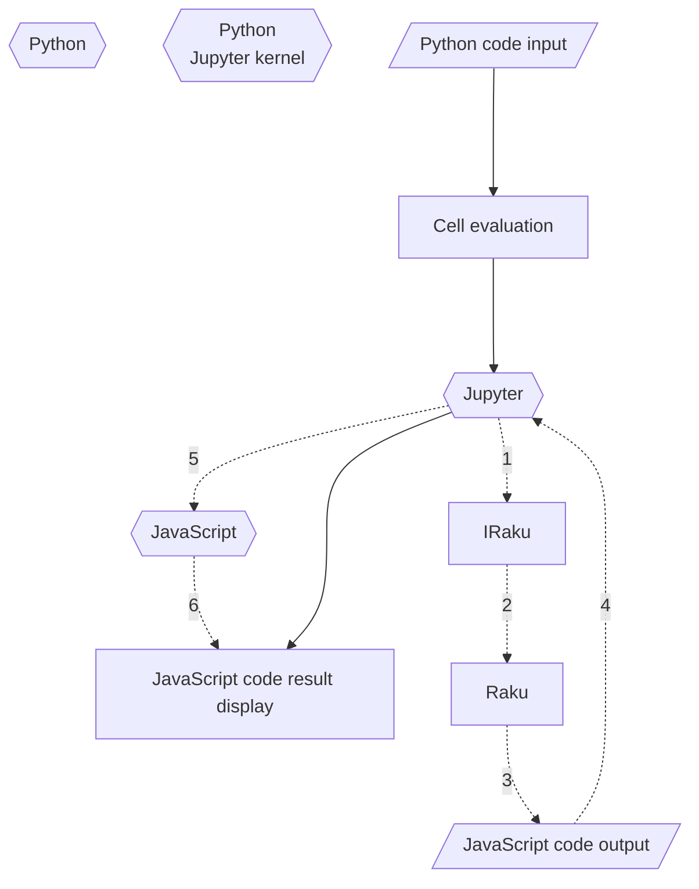

# JavaScriptD3 Python package

This repository has the a Python package for generation of JavaScript's D3 code for making plots and charts.

This package is intended to be used in Jupyter notebooks with Python kernels.
The commands of the package generate JavaScript code that produces (nice) [D3.js](https://d3js.org/) plots or charts.

For illustrative examples see the Jupyter notebook 
["Tests-for-JavaScriptD3"]().

The (original versions of the) JavaScript snippets used in this package are taken from 
["The D3.js Graph Gallery"](https://d3-graph-gallery.com/index.html).

The design and implementation of this package closely follows the [Raku package "JavaScript::D3"](https://raku.land/zef:antononcube/JavaScript::D3).

There is another Python package, ["ipychart"](https://github.com/nicohlr/ipychart),
that makes visualziations with JavaScript in Jupyter, but uses [Chart.js](https://www.chartjs.org) instead of [D3.js](https://d3js.org/).

--------

## Mission statement

Make first class -- beautiful, tunable, and useful -- plots and charts with Python using 
concise specifications.

--------

## Design and philosophy

Here is a list of guiding design principles:

- Concise plot and charts specifications.

- Using Mathematica's plot functions for commands signatures inspiration. 
  (Instead of, say, R's ["ggplot2"](https://ggplot2.tidyverse.org).)

  - For example, see [`ListPlot`](https://reference.wolfram.com/language/ref/ListPlot.html), 
    [`BubbleChart`](https://reference.wolfram.com/language/ref/BubbleChart.html).
  
- The primary target data structure to visualize is an array of hashes, 
   with all array elements having the one of these sets of keys 
   - `<x y>` 
   - `<x y group>`
   - `<x y z>`
   - `<x y z group>` 
   
- Multiple-dataset plots are produced via dataset records that have the key "group".  

- Whenever possible deduce the keys from arrays of scalars.

- The data manipulation functions of the package "pandas" should be nicely fit.

- Data frames of "pandas" and numerical array from "numpy", should be automatically ingested and transformed as much as reasonable. 
  (In order to get desired visualizations.)

- The package functions are tested separately:

  - As Python functions that produce output for given signatures
  - As JavaScript plots that correspond to the corresponding intents
  
--------

## How does it work?

Here is a diagram that summarizes the evaluation path from a Raku plot spec to a browser diagram:



Here is the corresponding narration:

1. Enter Python plot command in cell that starts with 
   [the magic spec `%% js`](https://github.com/bduggan/raku-jupyter-kernel/issues/100#issuecomment-1349494169).

   - Like `js_d3_list_plot(numpy.random.uniform(1,10,100))`.
   
2. Jupyter via the Python kernel evaluates the Python plot command.

3. The Python plot command produces JavaScript code.

4. The Jupyter "lets" the web browser to evaluate the obtained JavaScript code.

   - Instead of web browser, say, Visual Studio Code can be used.
   
The evaluation loop spelled out above is possible because of the [`%%javacript` magic cells implementation in the Jupyter](https://ipython.readthedocs.io/en/stable/interactive/magics.html).

----- 

## Usage examples

### Setup

Here we load some packages that are used to generate, summarize, and modify datasets:


```python
from RandomDataGenerators import *
import pandas
import numpy
```

Here we load some packages that are used to generate, summarize, and modify datasets:


```python
from JavaScriptD3 import *
```

Here we use a JavaScript cell that allows the visualization of with [D3.js](https://d3js.org) in Jupyter notebooks:


```javascript
%%javascript
require.config({
     paths: {
     d3: 'https://d3js.org/d3.v7.min'
}});

require(['d3'], function(d3) {
     console.log(d3);
});
```


    <IPython.core.display.Javascript object>


### Histogram

Here is an example of a histogram:


```python
 js_d3_histogram(
    numpy.random.normal(120, 10, 500),
    height=500, 
    background='white', 
    title='Normal distribution example',
    x_axis_label='random value',
    y_axis_label='counts', margins = {"top":120})
```


    <IPython.core.display.Javascript object>


### List line plot

Here we make random data:


```python
dfXYG = random_data_frame(400, ["x", "y", "group"],
        generators = { "x" : lambda size: numpy.random.uniform(0, 100, size=size),
                       "y" : lambda size: numpy.random.uniform(0, 10, size=size),
                        "group" : ["astro", "barista", "crom", "dark"] })   
dfXYG.sample(5)
```


<div>
<style scoped>
    .dataframe tbody tr th:only-of-type {
        vertical-align: middle;
    }

    .dataframe tbody tr th {
        vertical-align: top;
    }

    .dataframe thead th {
        text-align: right;
    }
</style>
<table border="1" class="dataframe">
  <thead>
    <tr style="text-align: right;">
      <th></th>
      <th>x</th>
      <th>y</th>
      <th>group</th>
    </tr>
  </thead>
  <tbody>
    <tr>
      <th>372</th>
      <td>38.825638</td>
      <td>7.152835</td>
      <td>astro</td>
    </tr>
    <tr>
      <th>227</th>
      <td>8.455611</td>
      <td>8.212151</td>
      <td>crom</td>
    </tr>
    <tr>
      <th>69</th>
      <td>38.492431</td>
      <td>6.388774</td>
      <td>crom</td>
    </tr>
    <tr>
      <th>121</th>
      <td>35.694540</td>
      <td>4.763404</td>
      <td>astro</td>
    </tr>
    <tr>
      <th>270</th>
      <td>98.590092</td>
      <td>8.886541</td>
      <td>astro</td>
    </tr>
  </tbody>
</table>
</div>


Here is an example of multi-line list plot:


```python
js_d3_list_line_plot(dfXYG.sort_values( ["x"] ), background='')
```


    <IPython.core.display.Javascript object>


### Bubble chart

Here we make some random data:


```python
df3DGroups = random_data_frame(100, ["x", "y", "z", "group"], 
    generators = { "x" : lambda size: numpy.random.uniform(0, 20, size=size),
                   "y" : lambda size: numpy.random.uniform(200, 50, size=size),
                   "z" : lambda size: numpy.random.normal(20, 12, size=size),
                   "group" : ["aspirin", "biscuit", "cookie"]
                  } )
df3DGroups.sample(5)
```


<div>
<style scoped>
    .dataframe tbody tr th:only-of-type {
        vertical-align: middle;
    }

    .dataframe tbody tr th {
        vertical-align: top;
    }

    .dataframe thead th {
        text-align: right;
    }
</style>
<table border="1" class="dataframe">
  <thead>
    <tr style="text-align: right;">
      <th></th>
      <th>x</th>
      <th>y</th>
      <th>z</th>
      <th>group</th>
    </tr>
  </thead>
  <tbody>
    <tr>
      <th>67</th>
      <td>13.962933</td>
      <td>120.956196</td>
      <td>27.915837</td>
      <td>cookie</td>
    </tr>
    <tr>
      <th>22</th>
      <td>13.797296</td>
      <td>158.308319</td>
      <td>31.905862</td>
      <td>aspirin</td>
    </tr>
    <tr>
      <th>35</th>
      <td>1.033294</td>
      <td>112.486546</td>
      <td>18.128586</td>
      <td>biscuit</td>
    </tr>
    <tr>
      <th>81</th>
      <td>12.033880</td>
      <td>53.989824</td>
      <td>21.682677</td>
      <td>cookie</td>
    </tr>
    <tr>
      <th>43</th>
      <td>14.374499</td>
      <td>84.026492</td>
      <td>17.529052</td>
      <td>biscuit</td>
    </tr>
  </tbody>
</table>
</div>


Here is an example of bubble chart (with tooltips):


```python
js_d3_bubble_chart(df3DGroups, 
    x_axis_label='x coordinates',
    y_axis_label='Normal distribution', 
    title='Bubble chart over groups',
    background='', 
    margins = {"left":60, "top" : 60},
    opacity=0.5, tooltip = True, legends=True)
```


    <IPython.core.display.Javascript object>


--------

## Alternatives

### Raku package

As it was mentioned abov, the design and implementation of this package closely follows the [Raku package "JavaScript::D3"](https://raku.land/zef:antononcube/JavaScript::D3).

### Different backend

Instead of using [D3.js](https://d3js.org) as a "backend" it is possible -- and instructive --
to implement Raku plotting functions that generate JavaScript code for the library 
[Chart.js](https://www.chartjs.org).

D3.js is lower level than Chart.js, hence in principle Chart.js is closer to the mission of this Python package.
I.e. at first I considered having Raku plotting implementations with Chart.js
(in a package called "JavaScript::Chart".)
But I had hard time making Chart.js plots work consistently within Jupyter.

As it was mentioned above, there is another Python package, ["ipychart"](https://github.com/nicohlr/ipychart),
that makes visualziations with JavaScript in Jupyter, but uses [Chart.js](https://www.chartjs.org) instead of [D3.js](https://d3js.org/).

--------

## Command Line Interface (CLI)

The package provides a CLI script that can be used to generate HTML files with plots or charts.

```shell
js_d3_graphics --help
```

***TBD..***

Here is an usage example that produces a list line plot:

```
 js_d3_graphics list-line-plot 1 2 2 12 33 41 15 5 -t="Nice plot" --x-label="My X" --y-label="My Y" > out.html && open out.html
```

Here is an example that produces bubble chart:

```
js_d3_graphics bubble-chart "1,1,10 2,2,12 33,41,15 5,3,30" -t="Nice plot" --x-label="My X" --y-label="My Y" > out.html && open out.htm
```

--------

## TODO

The following org mode file has a TODO list -- the highest priority items are placed first. 
(***TBD...***)


--------

## Implementation details

### Splicing of JavaScript snippets

The package works by splicing of parametrized JavaScript code snippets and replacing the parameters
with concrete values.

In a sense, JavaScript macros are used to construct the final code through text manipulation.
(Probably, unsound software-engineering-wise, but it works.)

...

--------

## References

### Articles

[OV1] Olivia Vane, 
["D3 JavaScript visualisation in a Python Jupyter notebook"](https://livingwithmachines.ac.uk/d3-javascript-visualisation-in-a-python-jupyter-notebook), 
(2020), 
[livingwithmachines.ac.uk](https://livingwithmachines.ac.uk).

[SF1] Stefaan Lippens, 
[Custom D3.js Visualization in a Jupyter Notebook](https://www.stefaanlippens.net/jupyter-custom-d3-visualization.html), 
(2018), 
[stefaanlippens.net](https://www.stefaanlippens.net).

### Packages

[AAp1] Anton Antonov,
[JavasScript::D3 Raku package]((https://raku.land/zef:antononcube/JavaScript::D3),
(2022),
[GitHub/antononcube](https://github.com/antononcube/Raku-JavaScript-D3).

[AAp2] Anton Antonov,
[Text::Plot Raku package](https://raku.land/zef:antononcube/Text::Plot),
(2022),
[GitHub/antononcube](https://github.com/antononcube/Raku-Text-Plot).

[NH1] Nicholas H,
[ipychart Python package](https://github.com/nicohlr/ipychart),
(2019-2022),
[GitHub/nicohlr](https://github.com/nicohlr/ipychart).


```python

```
