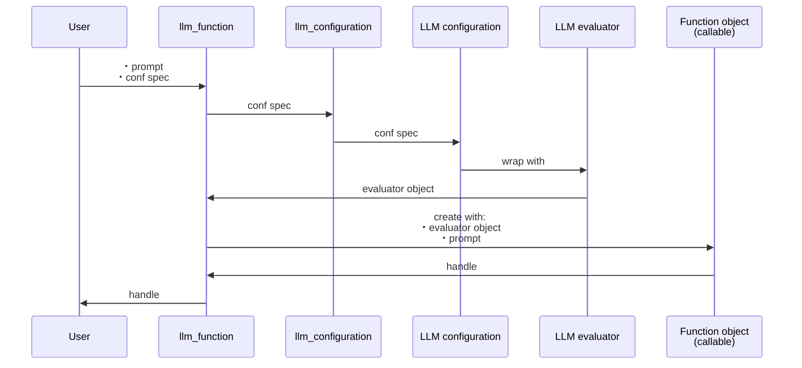
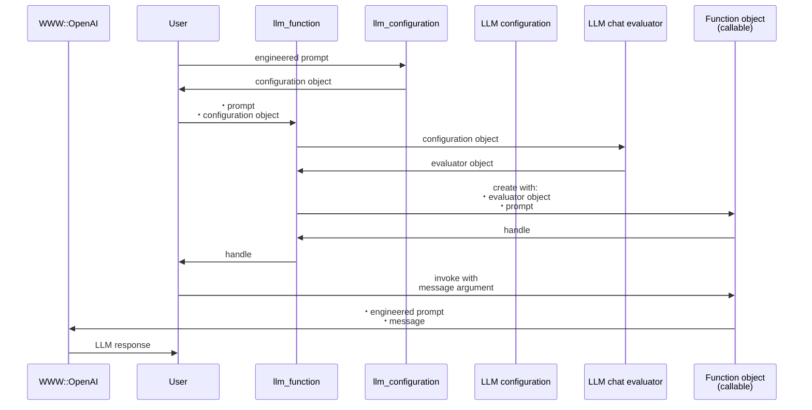

# LLMFunctionObjects


## In brief

This Python package provides functions and function objects to access, interact, and utilize 
Large Language Models (LLMs), like OpenAI, [OAI1], and PaLM, [ZG1].

The structure and implementation of this Python package closely follows the design and implementation
of the Raku package "LLM::Functions", [AAp1], supported by "Text::SubParsers", [AAp4].

*(Here is a [link to the corresponding notebook](https://github.com/antononcube/Python-packages/blob/main/LLMFunctionObjects/docs/LLM-function-objects.ipynb).)*

--------

## Installation

### Install from GitHub

```shell
pip install -e git+https://github.com/antononcube/Python-packages.git#egg=LLMFunctionObjects-antononcube\&subdirectory=LLMFunctionObjects
```

### From PyPi

```shell
pip install LLMFunctionObjects
```

--------

## Design

"Out of the box"
["LLMFunctionObjects"](https://pypi.org/project/LLMFunctionObjects) uses
["openai"](https://pypi.org/project/openai/), [OAIp1], and
["google-generativeai"](https://pypi.org/project/google-generativeai/), [GAIp1].
Other LLM access packages can be utilized via appropriate LLM configurations.

Configurations:
- Are instances of the class `LLMFunctionObjects.Configuration`
- Are used by instances of the class `LLMFunctionObjects.Evaluator`
- Can be converted to dictionary objects (i.e. have a `to_dict` method)

New LLM functions are constructed with the function `llm_function`.

The function `llm_function`:

- Produces objects that are set to be "callable" (i.e. function objects or functors)
- Has the option "llm_evaluator" that takes evaluators, configurations, or string shorthands as values
- Returns anonymous functions (that access LLMs via evaluators/configurations.)
- Gives result functions that can be applied to different types of arguments depending on the first argument
- Can take a (sub-)parser argument for post-processing of LLM results
- Takes as a first argument a prompt that can be a:
    - String
    - Function with positional arguments
    - Function with named arguments

Here is a sequence diagram that follows the steps of a typical creation procedure of 
LLM configuration- and evaluator objects, and the corresponding LLM-function that utilizes them:

!


Here is a sequence diagram for making a LLM configuration with a global (engineered) prompt,
and using that configuration to generate a chat message response:



------

## Configurations

### OpenAI-based

Here is the default, OpenAI-based configuration:


```python
from LLMFunctionObjects import *

for k, v in llm_configuration('OpenAI').to_dict().items():
    print(f"{k} : {repr(v)}")
```

    name : 'openai'
    api_key : None
    api_user_id : 'user'
    module : 'openai'
    model : 'gpt-3.5-turbo-instruct'
    function : <bound method Completion.create of <class 'openai.api_resources.completion.Completion'>>
    temperature : 0.2
    total_probability_cutoff : 0.03
    max_tokens : 300
    fmt : 'values'
    prompts : []
    prompt_delimiter : ' '
    stop_tokens : None
    tools : []
    tool_prompt : ''
    tool_request_parser : None
    tool_response_insertion_function : None
    argument_renames : {}
    evaluator : None
    known_params : ['api_key', 'model', 'prompt', 'suffix', 'max_tokens', 'temperature', 'top_p', 'n', 'stream', 'logprobs', 'stop', 'presence_penalty', 'frequency_penalty', 'best_of', 'logit_bias', 'user']
    response_object_attribute : None
    response_value_keys : ['choices', 0, 'text']
    llm_evaluator : <class 'LLMFunctionObjects.Evaluator.Evaluator'>


Here is the ChatGPT-based configuration:


```python
for k, v in llm_configuration('ChatGPT').to_dict().items():
    print(f"{k} : {repr(v)}")
```

    name : 'chatgpt'
    api_key : None
    api_user_id : 'user'
    module : 'openai'
    model : 'gpt-3.5-turbo-0613'
    function : <bound method ChatCompletion.create of <class 'openai.api_resources.chat_completion.ChatCompletion'>>
    temperature : 0.2
    total_probability_cutoff : 0.03
    max_tokens : 300
    fmt : 'values'
    prompts : []
    prompt_delimiter : ' '
    stop_tokens : None
    tools : []
    tool_prompt : ''
    tool_request_parser : None
    tool_response_insertion_function : None
    argument_renames : {}
    evaluator : None
    known_params : ['api_key', 'model', 'messages', 'functions', 'function_call', 'temperature', 'top_p', 'n', 'stream', 'logprobs', 'stop', 'presence_penalty', 'frequency_penalty', 'logit_bias', 'user']
    response_object_attribute : None
    response_value_keys : ['choices', 0, 'message', 'content']
    llm_evaluator : <class 'LLMFunctionObjects.EvaluatorChatGPT.EvaluatorChatGPT'>


**Remark:** `llm_configuration(None)` is equivalent to `llm_configuration('OpenAI')`.

**Remark:** Both the "OpenAI" and "ChatGPT" configuration use functions of the package "openai", [OAIp1].
The "OpenAI" configuration is for text-completions;
the "ChatGPT" configuration is for chat-completions. 

### PaLM-based

Here is the default PaLM configuration:


```python
for k, v in llm_configuration('PaLM').to_dict().items():
    print(f"{k} : {repr(v)}")
```

    name : 'palm'
    api_key : None
    api_user_id : 'user'
    module : 'google.generativeai'
    model : 'models/text-bison-001'
    function : <function generate_text at 0x10a04b6d0>
    temperature : 0.2
    total_probability_cutoff : 0.03
    max_tokens : 300
    fmt : 'values'
    prompts : []
    prompt_delimiter : ' '
    stop_tokens : None
    tools : []
    tool_prompt : ''
    tool_request_parser : None
    tool_response_insertion_function : None
    argument_renames : {}
    evaluator : None
    known_params : ['model', 'prompt', 'temperature', 'candidate_count', 'max_output_tokens', 'top_p', 'top_k', 'safety_settings', 'stop_sequences', 'client']
    response_object_attribute : 'result'
    response_value_keys : []
    llm_evaluator : <class 'LLMFunctionObjects.Evaluator.Evaluator'>


-------

## Basic usage of LLM functions

### Textual prompts

Here we make a LLM function with a simple (short, textual) prompt:


```python
func = llm_function('Show a recipe for:')
```

Here we evaluate over a message: 


```python
print(func('greek salad'))
```

    
    
    Greek Salad Recipe:
    
    Ingredients:
    - 1 large cucumber, diced
    - 2 large tomatoes, diced
    - 1 red onion, thinly sliced
    - 1 green bell pepper, diced
    - 1/2 cup Kalamata olives, pitted and halved
    - 1/2 cup crumbled feta cheese
    - 1/4 cup extra virgin olive oil
    - 2 tablespoons red wine vinegar
    - 1 teaspoon dried oregano
    - Salt and pepper to taste
    
    Instructions:
    
    1. In a large bowl, combine the diced cucumber, tomatoes, red onion, bell pepper, and Kalamata olives.
    
    2. In a small bowl, whisk together the olive oil, red wine vinegar, dried oregano, and salt and pepper.
    
    3. Pour the dressing over the vegetables and toss to combine.
    
    4. Sprinkle the crumbled feta cheese over the top of the salad.
    
    5. Serve immediately or refrigerate until ready to serve.
    
    Optional: You can also add some chopped fresh herbs, such as parsley or dill, for extra flavor and freshness. Enjoy your delicious and refreshing Greek salad!


### Positional arguments

Here we make a LLM function with a function-prompt and numeric interpreter of the result:


```python
func2 = llm_function(
    lambda a, b: f"How many {a} can fit inside one {b}?",
    form=float,
    llm_evaluator='palm')
```

Here were we apply the function:


```python
res2 = func2("tennis balls", "toyota corolla 2010")
res2
```


    350.0


Here we show that we got a number:


```python
type(res2)
```


    float


### Named arguments

Here the first argument is a template with two named arguments: 


```python
func3 = llm_function(lambda dish, cuisine: f"Give a recipe for {dish} in the {cuisine} cuisine.", llm_evaluator='palm')
```


Here is an invocation:


```python
print(func3(dish='salad', cuisine='Russian', max_tokens=300))
```

    **Ingredients:**
    
    * 1 head of cabbage, shredded
    * 1 carrot, grated
    * 1/2 cup of peas, cooked
    * 1/2 cup of chopped walnuts
    * 1/2 cup of mayonnaise
    * 1/4 cup of sour cream
    * Salt and pepper to taste
    
    **Instructions:**
    
    1. In a large bowl, combine the cabbage, carrots, and peas.
    2. In a small bowl, whisk together the mayonnaise, sour cream, salt, and pepper.
    3. Pour the dressing over the salad and toss to coat.
    4. Serve immediately or chill for later.
    
    **Tips:**
    
    * For a more flavorful salad, add some chopped fresh herbs, such as dill or parsley.
    * You can also add some chopped red onion or celery to the salad.
    * If you don't have any peas on hand, you can use green beans or corn instead.
    * The dressing can be made ahead of time and stored in the refrigerator. Just be sure to bring it to room temperature before using it to dress the salad.


--------

## LLM example functions

The function `llm_example_function` can be given a training set of examples in order 
to generating results according to the "laws" implied by that training set.  

Here a LLM is asked to produce a generalization:


```python
llm_example_function({'finger': 'hand', 'hand': 'arm'})('foot')
```


    ' leg'


Here is an array of training pairs is used:


```python
 llm_example_function({"Einstein": "14 March 1879", "Pauli": "April 25, 1900"})('Oppenheimer')
```


    ' April 22, 1904'


Here is defined a LLM function for translating WL associations into Python dictionaries:


```python
fea = llm_example_function(('<| A->3, 4->K1 |>', '{ A:3, 4:K1 }'))
print(fea('<| 23->3, G->33, T -> R5|>'))
```

     { 23:3, G:33, T:R5 }


The function `llm_example_function` takes as a first argument:
- Single `tuple` object of two scalars
- A `dict`
- A `list` object of pairs (`tuple` objects)

**Remark:** The function `llm_example_function` is implemented with `llm_function` and suitable prompt.

Here is an example of using hints:


```python
fec = llm_example_function(
    {"crocodile" : "grasshopper", "fox" : "cardinal"},
    hint = 'animal colors')

print(fec('raccoon'))
```

     cardinal

### Synthesizing responses

Here is an example of prompt synthesis with the function `llm_synthesize` using prompts from the package ["LLMPrompts"](https://pypi.org/project/LLMPrompts/), [AAp8]:


```python
from LLMPrompts import *

print(
    llm_synthesize([
        llm_prompt("Yoda"), 
        "Hi! How old are you?",
        llm_prompt("HaikuStyled")
    ]))
```

    
    
    Young or old, matters not
    Age is just a number, hmm
    The Force is with me.


--------

## Using chat-global prompts

The configuration objects can be given prompts that influence the LLM responses 
"globally" throughout the whole chat. (See the second sequence diagram above.)

--------

## Chat objects

Here we create chat object that uses OpenAI's ChatGPT:


```python
prompt = "You are a gem expert and you give concise answers."
chat = llm_chat(prompt = prompt, chat_id = 'gem-expert-talk', conf = 'ChatGPT')
```


```python
chat.eval('What is the most transparent gem?')
```


    'The most transparent gem is diamond.'


```python
chat.eval('Ok. What are the second and third most transparent gems?')
```


    'The second most transparent gem is sapphire, and the third most transparent gem is emerald.'


Here are the prompt(s) and all messages of the chat object:


```python
chat.print()
```

    Chat ID: gem-expert-talk
    ------------------------------------------------------------
    Prompt:
    You are a gem expert and you give concise answers.
    ------------------------------------------------------------
    {'role': 'user', 'content': 'What is the most transparent gem?', 'timestamp': 1695699574.024279}
    ------------------------------------------------------------
    {'role': 'assistant', 'content': 'The most transparent gem is diamond.', 'timestamp': 1695699575.158463}
    ------------------------------------------------------------
    {'role': 'user', 'content': 'Ok. What are the second and third most transparent gems?', 'timestamp': 1695699588.455979}
    ------------------------------------------------------------
    {'role': 'assistant', 'content': 'The second most transparent gem is sapphire, and the third most transparent gem is emerald.', 'timestamp': 1695699589.6835861}


--------

## Potential and known problems

The LLM frameworks of OpenAI and Google are changed often, which produces problems that are generally three types:

- Implementation based on obsolete design of the corresponding Python packages for accessing LLMs
- Obsolete models
- Obsolete signatures

Currently, for Google's PaLM the method "ChatPaLM" and the method "PaLM" does not.
Note, that PaLM itself is being considered "legacy" by Google. (It is replaced with Gemini, or other.)

Generally, speaking prefer using the "Chat" prefixed methods: "ChatGPT" and "ChatPaLM".
(OpenAI does/did say that it "simple" text completion models are obsoleted.)

--------

## References

### Articles

[AA1] Anton Antonov,
["Generating documents via templates and LLMs"](https://rakuforprediction.wordpress.com/2023/07/11/generating-documents-via-templates-and-llms/),
(2023),
[RakuForPrediction at WordPress](https://rakuforprediction.wordpress.com).

[ZG1] Zoubin Ghahramani,
["Introducing PaLM 2"](https://blog.google/technology/ai/google-palm-2-ai-large-language-model/),
(2023),
[Google Official Blog on AI](https://blog.google/technology/ai/).

### Repositories, sites

[OAI1] OpenAI Platform, [OpenAI platform](https://platform.openai.com/).

[WRIr1] Wolfram Research, Inc.
[Wolfram Prompt Repository](https://resources.wolframcloud.com/PromptRepository/).

### Packages, paclets

[AAp1] Anton Antonov,
[LLM::Functions Raku package](https://github.com/antononcube/Raku-LLM-Functions),
(2023),
[GitHub/antononcube](https://github.com/antononcube).

[AAp2] Anton Antonov,
[WWW::OpenAI Raku package](https://github.com/antononcube/Raku-WWW-OpenAI),
(2023),
[GitHub/antononcube](https://github.com/antononcube).

[AAp3] Anton Antonov,
[WWW::PaLM Raku package](https://github.com/antononcube/Raku-WWW-PaLM),
(2023),
[GitHub/antononcube](https://github.com/antononcube).

[AAp4] Anton Antonov,
[Text::SubParsers Raku package](https://github.com/antononcube/Raku-Text-SubParsers),
(2023),
[GitHub/antononcube](https://github.com/antononcube).

[AAp5] Anton Antonov,
[Text::CodeProcessing Raku package](https://github.com/antononcube/Raku-Text-CodeProcessing),
(2021),
[GitHub/antononcube](https://github.com/antononcube).

[AAp6] Anton Antonov,
[ML::FindTextualAnswer Raku package](https://github.com/antononcube/Raku-ML-FindTextualAnswer),
(2023),
[GitHub/antononcube](https://github.com/antononcube).

[AAp7] Anton Antonov,
[ML::NLPTemplateEngine Raku package](https://github.com/antononcube/Raku-ML-NLPTemplateEngine),
(2023),
[GitHub/antononcube](https://github.com/antononcube).

[AAp8] Anton Antonov,
[LLMPrompts Python package](https://pypi.org/project/LLMPrompts/),
(2023),
[PyPI.org/antononcube](https://pypi.org/user/antononcube/).

[GAIp1] Google AI,
[google-generativeai (Google Generative AI Python Client)](https://pypi.org/project/google-generativeai/),
(2023),
[PyPI.org/google-ai](https://pypi.org/user/google-ai/).

[OAIp1] OpenAI, 
[openai (OpenAI Python Library)](https://pypi.org/project/openai/),
(2020-2023),
[PyPI.org](https://pypi.org/).

[WRIp1] Wolfram Research, Inc.
[LLMFunctions paclet](https://resources.wolframcloud.com/PacletRepository/resources/Wolfram/LLMFunctionObjects/),
(2023),
[Wolfram Language Paclet Repository](https://resources.wolframcloud.com/PacletRepository/).
