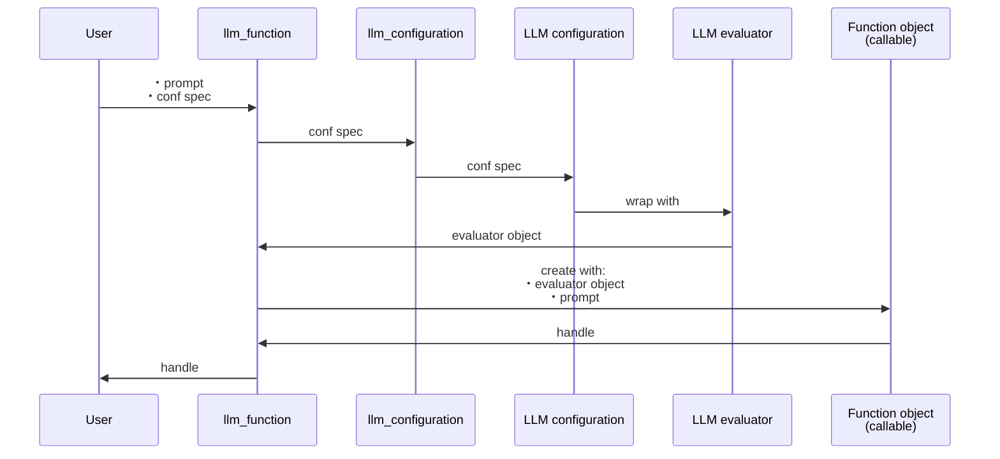
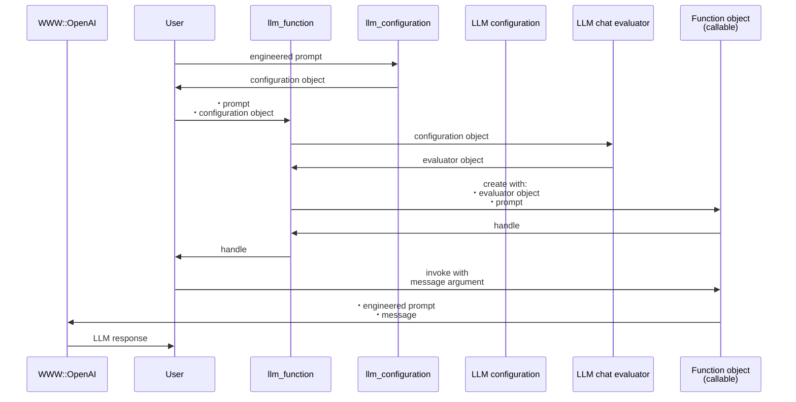

# LLMFunctionObjects


## In brief

This Python package provides functions and function objects to access, interact, and utilize 
Large Language Models (LLMs), like OpenAI, [OAI1], and Gemini, [ZG1].

The structure and implementation of this Python package closely follows the design and implementation
of the Raku package "LLM::Functions", [AAp1], supported by "Text::SubParsers", [AAp4].

*(Here is a [link to the corresponding notebook](https://github.com/antononcube/Python-packages/blob/main/LLMFunctionObjects/docs/LLM-function-objects.ipynb).)*


---

## Installation

### Install from GitHub

```
pip install -e git+https://github.com/antononcube/Python-packages.git#egg=LLMFunctionObjects-antononcube\&subdirectory=LLMFunctionObjects
```

### From PyPi

```
pip install LLMFunctionObjects
```

---

## Design

"Out of the box" ["LLMFunctionObjects"](https://pypi.org/project/LLMFunctionObjects) uses ["openai"](https://pypi.org/project/openai/), [OAIp1], and ["google-generativeai"](https://pypi.org/project/google-generativeai/), [GAIp1], and ["ollama"](https://pypi.org/project/ollama/).

Other LLM access packages can be utilized via appropriate LLM configurations.

Configurations:
- Are instances of the class `LLMFunctionObjects.Configuration`
- Are used by instances of the class `LLMFunctionObjects.Evaluator`
- Can be converted to dictionary objects (i.e. have a `to_dict` method)

New LLM functions are constructed with the function `llm_function`.

The function `llm_function`:
- Produces objects that are set to be "callable" (i.e. function objects or functors)
- Has the option "llm_evaluator" that takes evaluators, configurations, or string shorthands as values
- Returns anonymous functions (that access LLMs via evaluators/configurations.)
- Gives result functions that can be applied to different types of arguments depending on the first argument
- Can take a (sub-)parser argument for post-processing of LLM results
- Takes as a first argument a prompt that can be a:
    - String
    - Function with positional arguments
    - Function with named arguments


Here is a sequence diagram that follows the steps of a typical creation procedure of LLM configuration- and evaluator objects, and the corresponding LLM-function that utilizes them:



Here is a sequence diagram for making a LLM configuration with a global (engineered) prompt, and using that configuration to generate a chat message response:



---

## Configurations

### OpenAI-based

Here is the default, OpenAI-based configuration:

```python
from LLMFunctionObjects import *

for k, v in llm_configuration('OpenAI').to_dict().items():
    print(f"{k} : {repr(v)}")
```

Here is the ChatGPT-based configuration:

```python
for k, v in llm_configuration('ChatGPT').to_dict().items():
    print(f"{k} : {repr(v)}")
```

**Remark:** `llm_configuration(None)` is equivalent to `llm_configuration('OpenAI')`.

**Remark:** Both the "OpenAI" and "ChatGPT" configuration use functions of the package "openai", [OAIp1].
The "OpenAI" configuration is for text-completions;
the "ChatGPT" configuration is for chat-completions. 

### Gemini-based

Here is the default Gemini configuration:

```python
for k, v in llm_configuration('Gemini').to_dict().items():
    print(f"{k} : {repr(v)}")
```

### Ollama-based

Here is the default Ollama configuration:

```python
for k, v in llm_configuration('Ollama').to_dict().items():
    print(f"{k} : {repr(v)}")
```

---

## Basic usage of LLM functions

### Textual prompts

Here we make a LLM function with a simple (short, textual) prompt:

```python
func = llm_function('Show a recipe for:')
```

Here we evaluate over a message: 

```python
print(func('greek salad'))
```

```
# Here's a simple and classic recipe for Greek Salad:
# 
# Ingredients:
# - 3 large tomatoes, cut into wedges
# - 1 cucumber, sliced
# - 1 green bell pepper, sliced
# - 1 red onion, thinly sliced
# - 200g (about 7 oz) feta cheese, cut into cubes or crumbled
# - A handful of Kalamata olives
# - 2 tablespoons extra virgin olive oil
# - 1 tablespoon red wine vinegar
# - 1 teaspoon dried oregano
# - Salt and freshly ground black pepper to taste
# 
# Instructions:
# 1. In a large bowl, combine the tomatoes, cucumber, green bell pepper, and red onion.
# 2. Add the Kalamata olives and feta cheese on top.
# 3. In a small bowl, whisk together the olive oil, red wine vinegar, oregano, salt, and pepper.
# 4. Pour the dressing over the salad and toss gently to combine.
# 5. Serve immediately, or chill in the refrigerator for 30 minutes to allow the flavors to meld.
# 
# Enjoy your fresh and flavorful Greek Salad!

```

Local Ollama example (requires a running Ollama server and a pulled model):

```python
func_local = llm_function('Answer briefly:', e='Ollama')
print(func_local('What is the capital of France?'))
```

```
# The capital of France is Paris.

```

### Positional arguments

Here we make a LLM function with a function-prompt and numeric interpreter of the result:

```python
llm_prompt_data('NumericOnly')
```

```
# {'NumericOnly': {'Name': 'NumericOnly',
   'Description': 'Modify results to give numerical responses only',
   'PromptText': 'Respond with numerical responses only. Exclude any non-numerical responses. Do not include include any letters. Change words into numbers if possible, for example instead of "1 billion" write "1000000000".',
   'PositionalArguments': [],
   'NamedArguments': [],
   'Arity': 0,
   'Categories': ['Modifier Prompts'],
   'Topics': ['Output Formatting'],
   'Keywords': ['Numbers', 'Rewrite'],
   'ContributedBy': 'Wolfram Staff',
   'URL': 'https://resources.wolframcloud.com/PromptRepository/resources/NumericOnly'}}
```

```python
func2 = llm_function(
    lambda a, b: f"How many {a} can fit inside one {b}?" + 
                "Respond with numerical responses only. Do not include include any letters. ",
    form=float,
    llm_evaluator='chatgpt')
```

Here were we apply the function:

```python
res2 = func2("tennis balls", "toyota corolla 2010")
res2
```

```
# 41666.0
```

Here we show that we got a number:

```python
type(res2)
```

```
# float
```

### Named arguments

Here the first argument is a template with two named arguments: 

```python
func3 = llm_function(lambda dish, cuisine: f"Give a recipe for {dish} in the {cuisine} cuisine.", llm_evaluator='ollama')
```

Here is an invocation:

```python
print(func3(dish='salad', cuisine='Russian', max_tokens=300))
```

```
# A classic Russian salad! Here's a simple and delicious recipe for "Salad Olga" or "Russian Salad", also known as "Olivier salad":
# 
# **Ingredients:**
# 
# * 1 cup cooked beef (boiled, diced)
# * 1 cup cooked chicken (boiled, diced)
# * 1/2 cup diced hard-boiled egg
# * 1/2 cup diced onion
# * 1/4 cup pickled beets (canned or homemade)
# * 1/4 cup chopped fresh parsley
# * 1/4 cup chopped fresh dill
# * 2 tablespoons Russian mustard (or plain Dijon mustard)
# * Salt and pepper to taste
# * 2 tablespoons vegetable oil
# 
# **Instructions:**
# 
# 1. In a large bowl, combine the cooked beef, chicken, egg, onion, pickled beets, parsley, and dill.
# 2. In a small bowl, whisk together the Russian mustard and vegetable oil.
# 3. Pour the dressing over the salad mixture and stir until everything is well combined.
# 4. Season with salt and pepper to taste.
# 5. Cover the bowl with plastic wrap and refrigerate for at least 30 minutes to allow the flavors to meld.
# 
# **Traditional Variations:**
# 
# * Some Russian recipes add diced carrots, potatoes, or peas to the salad.
# * Others use chopped boiled sausage or capers instead of pickled beets.
# * You can also add a squeeze of fresh lemon juice for extra brightness.
# 
# **Russian Mustard (Moloko-Syre):**
# If you can't find Russian mustard, you can make your own by mixing equal parts of milk and vinegar. This creates a creamy and tangy dressing that's a hallmark of traditional Russian salads.
# 
# Enjoy your delicious and authentic Russian salad!

```

---

## LLM example functions

The function `llm_example_function` can be given a training set of examples in order 
to generating results according to the "laws" implied by that training set.  

Here a LLM is asked to produce a generalization:

```python
llm_example_function({'finger': 'hand', 'hand': 'arm'})('foot')
```

```
# 'The pattern seems to be related to parts of the body where "hand" corresponds to "arm." Following this pattern, the output for "foot" would be "leg."'
```

Here is an array of training pairs is used:

```python
llm_example_function({"Einstein": "14 March 1879", "Pauli": "April 25, 1900"})('Oppenheimer')
```

```
# 'The output for the input "Oppenheimer" would be "July 22, 1904".'
```

Here is defined a LLM function for translating WL associations into Python dictionaries:

```python
fea = llm_example_function(('<| A->3, 4->K1 |>', '{ A:3, 4:K1 }'))
print(fea('<| 23->3, G->33, T -> R5|>'))
```

```
# Output: { 23: 3, G: 33, T: R5 }

```

The function `llm_example_function` takes as a first argument:

- Single `tuple` object of two scalars
- A `dict`
- A `list` object of pairs (`tuple` objects)


**Remark:** The function `llm_example_function` is implemented with `llm_function` and suitable prompt.

Here is an example of using hints:

```python
fec = llm_example_function(
    {"crocodile" : "grasshopper", "fox" : "cardinal"},
    hint = 'animal colors', e = 'ollama')

print(fec('raccoon'))
```

```
# Raccoon - black and white

```

### Synthesizing responses

Here is an example of prompt synthesis with the function `llm_synthesize` using prompts from the package ["LLMPrompts"](https://pypi.org/project/LLMPrompts/), [AAp8]:

```python
from LLMPrompts import *

print(
    llm_synthesize([
        llm_prompt("Yoda"), 
        "Hi! How old are you?",
        llm_prompt("HaikuStyled")
    ]))
```

```
# Old, I am, yes.
# Wisdom deep as stars above,
# Time flows, I endure.

```

---

## Using chat-global prompts

The configuration objects can be given prompts that influence the LLM responses 
"globally" throughout the whole chat. (See the second sequence diagram above.)

---

## Chat objects

Here we create chat object that uses OpenAI's ChatGPT:

```python
prompt = "You are a gem expert and you give concise answers."
chat = llm_chat(prompt = prompt, chat_id = 'gem-expert-talk', conf = 'ChatGPT')
```

```python
chat.eval('What is the most transparent gem?')
```

```
# 'The most transparent gem is typically considered to be diamond. Diamonds have exceptional clarity and brilliance, making them highly transparent and prized in jewelry.'
```

```python
chat.eval('Ok. What are the second and third most transparent gems?')
```

```
# 'The second most transparent gem is usually white sapphire, known for its clarity and durability. The third most transparent gem is often zircon, which has high brilliance and good transparency.'
```

Here are the prompt(s) and all messages of the chat object:

```python
chat.print()
```

```
# Chat ID: gem-expert-talk
# ------------------------------------------------------------
# Prompt:
# You are a gem expert and you give concise answers.
# ------------------------------------------------------------
# {'role': 'user', 'content': 'What is the most transparent gem?', 'timestamp': 1771017949.900129}
# ------------------------------------------------------------
# {'role': 'assistant', 'content': 'The most transparent gem is typically considered to be diamond. Diamonds have exceptional clarity and brilliance, making them highly transparent and prized in jewelry.', 'timestamp': 1771017951.720435}
# ------------------------------------------------------------
# {'role': 'user', 'content': 'Ok. What are the second and third most transparent gems?', 'timestamp': 1771017951.7310028}
# ------------------------------------------------------------
# {'role': 'assistant', 'content': 'The second most transparent gem is usually white sapphire, known for its clarity and durability. The third most transparent gem is often zircon, which has high brilliance and good transparency.', 'timestamp': 1771017953.605421}

```

---

## Potential and known problems

The LLM frameworks of OpenAI and Google are changed often, which produces problems that are generally three types:

- Implementation based on obsolete design of the corresponding Python packages for accessing LLMs
- Obsolete models
- Obsolete signatures


Currently, for Google's Gemini the method "ChatGemini" works better than the method "Gemini".
Note, that PaLM itself is considered legacy by Google and is replaced with Gemini.

Generally, speaking prefer using the "Chat" prefixed methods: "ChatGPT" and "ChatGemini".
(OpenAI does/did say that it "simple" text completion models are obsoleted.)

---

## References

### Articles

[AA1] Anton Antonov,
["Generating documents via templates and LLMs"](https://rakuforprediction.wordpress.com/2023/07/11/generating-documents-via-templates-and-llms/),
(2023),
[RakuForPrediction at WordPress](https://rakuforprediction.wordpress.com).

[ZG1] Google AI,
["Gemini models overview"](https://ai.google.dev/gemini-api/docs/models/gemini),
(2024),
[Google AI documentation](https://ai.google.dev/).

### Repositories, sites

[OAI1] OpenAI Platform, [OpenAI platform](https://platform.openai.com/).

[WRIr1] Wolfram Research, Inc.
[Wolfram Prompt Repository](https://resources.wolframcloud.com/PromptRepository/).

### Packages, paclets

[AAp1] Anton Antonov,
[LLM::Functions Raku package](https://github.com/antononcube/Raku-LLM-Functions),
(2023),
[GitHub/antononcube](https://github.com/antononcube).

[AAp2] Anton Antonov,
[WWW::OpenAI Raku package](https://github.com/antononcube/Raku-WWW-OpenAI),
(2023),
[GitHub/antononcube](https://github.com/antononcube).

[AAp3] Anton Antonov,
[WWW::PaLM Raku package](https://github.com/antononcube/Raku-WWW-PaLM),
(2023),
[GitHub/antononcube](https://github.com/antononcube).

[AAp4] Anton Antonov,
[Text::SubParsers Raku package](https://github.com/antononcube/Raku-Text-SubParsers),
(2023),
[GitHub/antononcube](https://github.com/antononcube).

[AAp5] Anton Antonov,
[Text::CodeProcessing Raku package](https://github.com/antononcube/Raku-Text-CodeProcessing),
(2021),
[GitHub/antononcube](https://github.com/antononcube).

[AAp6] Anton Antonov,
[ML::FindTextualAnswer Raku package](https://github.com/antononcube/Raku-ML-FindTextualAnswer),
(2023),
[GitHub/antononcube](https://github.com/antononcube).

[AAp7] Anton Antonov,
[ML::NLPTemplateEngine Raku package](https://github.com/antononcube/Raku-ML-NLPTemplateEngine),
(2023),
[GitHub/antononcube](https://github.com/antononcube).

[AAp8] Anton Antonov,
[LLMPrompts Python package](https://pypi.org/project/LLMPrompts/),
(2023),
[PyPI.org/antononcube](https://pypi.org/user/antononcube/).

[GAIp1] Google AI,
[google-generativeai (Google Generative AI Python Client)](https://pypi.org/project/google-generativeai/),
(2023),
[PyPI.org/google-ai](https://pypi.org/user/google-ai/).

[OAIp1] OpenAI, 
[openai (OpenAI Python Library)](https://pypi.org/project/openai/),
(2020-2023),
[PyPI.org](https://pypi.org/).

[WRIp1] Wolfram Research, Inc.
[LLMFunctions paclet](https://resources.wolframcloud.com/PacletRepository/resources/Wolfram/LLMFunctionObjects/),
(2023),
[Wolfram Language Paclet Repository](https://resources.wolframcloud.com/PacletRepository/).