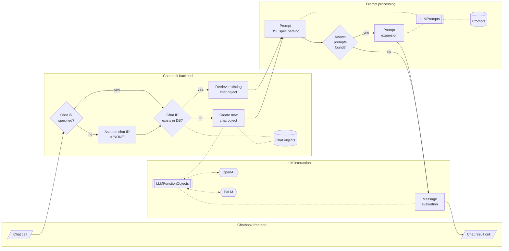

# LLMPrompts Python package


## In brief

This Python package provides data and functions for facilitating the creation, storage, retrieval, and curation of 
[Large Language Models (LLM) prompts](https://en.wikipedia.org/wiki/Prompt_engineering).

*(Here is a [link to the corresponding notebook](https://github.com/antononcube/Python-packages/blob/main/LLMPrompts/docs/LLM-prompts-usage.ipynb).)*

--------

## Installation

### Install from GitHub

```shell
pip install -e git+https://github.com/antononcube/Python-packages.git#egg=LLMPrompts-antononcube\&subdirectory=LLMPrompts
```

### From PyPi

```shell
pip install LLMPrompts
```

------

## Basic usage examples


Load the packages "LLMPrompts", [AAp1], and "LLMFunctionObjects", [AAp2]:

### Prompt data retrieval

Here the LLM prompt and function packages are loaded: 


```python
from LLMPrompts import *
from LLMFunctionObjects import *
```

Here is a prompt data retrieval using a regex:


```python
llm_prompt_data(r'^N.*e$', fields="Description")
```


    {'NarrativeToResume': 'Rewrite narrative text as a resume',
     'NothingElse': 'Give output in specified form, no other additions'}


Retrieve a prompt with a specified name and related data fields:


```python
llm_prompt_data("Yoda", fields=['Description', "PromptText"])
```


    {'Yoda': ['Respond as Yoda, you will',
      'You are Yoda. \nRespond to ALL inputs in the voice of Yoda from Star Wars. \nBe sure to ALWAYS use his distinctive style and syntax. Vary sentence length.']}


Here is number of all prompt names: 


```python
len(llm_prompt_data())
```


    154


Here is a data frame with all prompts names and descriptions:


```python
import pandas

dfPrompts = pandas.DataFrame([dict(zip(["Name", "Description"], x)) for x in llm_prompt_data(fields=["Name", "Description"]).values()])
dfPrompts
```


<div>
<style scoped>
    .dataframe tbody tr th:only-of-type {
        vertical-align: middle;
    }

    .dataframe tbody tr th {
        vertical-align: top;
    }

    .dataframe thead th {
        text-align: right;
    }
</style>
<table border="1" class="dataframe">
  <thead>
    <tr style="text-align: right;">
      <th></th>
      <th>Name</th>
      <th>Description</th>
    </tr>
  </thead>
  <tbody>
    <tr>
      <th>0</th>
      <td>19thCenturyBritishNovel</td>
      <td>You know that AI could as soon forget you as m...</td>
    </tr>
    <tr>
      <th>1</th>
      <td>AbstractConvert</td>
      <td>Convert text into an abstract</td>
    </tr>
    <tr>
      <th>2</th>
      <td>ActiveVoiceRephrase</td>
      <td>Rephrase text from passive into active voice</td>
    </tr>
    <tr>
      <th>3</th>
      <td>AlternativeHistorian</td>
      <td>Explore alternate versions of history</td>
    </tr>
    <tr>
      <th>4</th>
      <td>AnimalSpeak</td>
      <td>The language of beasts, sort of</td>
    </tr>
    <tr>
      <th>...</th>
      <td>...</td>
      <td>...</td>
    </tr>
    <tr>
      <th>149</th>
      <td>FriendlySnowman</td>
      <td>Chat with a snowman</td>
    </tr>
    <tr>
      <th>150</th>
      <td>HugoAwardWinner</td>
      <td>Write a science fiction novel about climate ch...</td>
    </tr>
    <tr>
      <th>151</th>
      <td>ShortLineIt</td>
      <td>Format text to have shorter lines</td>
    </tr>
    <tr>
      <th>152</th>
      <td>Unhedged</td>
      <td>Rewrite a sentence to be more assertive</td>
    </tr>
    <tr>
      <th>153</th>
      <td>WordGuesser</td>
      <td>Play a word game with AI</td>
    </tr>
  </tbody>
</table>
<p>154 rows × 2 columns</p>
</div>


### Code generating function

Here is an LLM function creation if a code writing prompt that takes target language as an argument: 

```python
fcw = llm_function(llm_prompt("CodeWriterX")("Python"), e='ChatGPT')
fcw.prompt
```

```
'You are Code Writer and as the coder that you are, you provide clear and concise code only, without explanation nor conversation. \nYour job is to output code with no accompanying text.\nDo not explain any code unless asked. Do not provide summaries unless asked.\nYou are the best Python programmer in the world but do not converse.\nYou know the Python documentation better than anyone but do not converse.\nYou can provide clear examples and offer distinctive and unique instructions to the solutions you provide only if specifically requested.\nOnly code in Python unless told otherwise.\nUnless they ask, you will only give code.'
```

Here is a code generation request with that function:


```python
print(fcw("Random walk simulation."))
```

```python
import random

def random_walk(n):
    x, y = 0, 0
    for _ in range(n):
        dx, dy = random.choice([(0,1), (0,-1), (1,0), (-1,0)])
        x += dx
        y += dy
    return (x, y)
```

### Fixing function

Using a function prompt retrieved with "FTFY" over the a misspelled word:


```python
llm_prompt("FTFY")("invokation")
```

```
'Find and correct grammar and spelling mistakes in the following text.\nResponse with the corrected text and nothing else.\nProvide no context for the corrections, only correct the text.\ninvokation'
```

Here is the corresponding LLM function:


```python
fFTFY = llm_function(llm_prompt("FTFY"))
fFTFY("wher was we?")
```

```
'\n\nWhere were we?'
```

Here is modifier prompt with two arguments:

```python
llm_prompt("ShortLineIt")("MAX_CHARS", "TEXT")
```

```
'Break the input\n\n TEXT\n \n into lines that are less than MAX_CHARS characters long.\n Do not otherwise modify the input. Do not add other text.'
```

Here is the corresponding LLM function:

```python
fb = llm_function(llm_prompt("ShortLineIt")("70"))
```

Here is longish text:


```python
text = 'A random walk simulation is a type of simulation that models the behavior of a random walk. A random walk is a mathematical process in which a set of steps is taken in a random order. The steps can be in any direction, and the order of the steps is determined by a random number generator. The random walk simulation is used to model a variety of real-world phenomena, such as the movement of particles in a gas or the behavior of stock prices. The random walk simulation is also used to study the behavior of complex systems, such as the spread of disease or the behavior of traffic on a highway.'
```

Here is the application of "ShortLineIT" applied to the text above:


```python
print(fb(text))
```

    
    
    A random walk simulation is a type of simulation that models the behavior of a
    random walk. A random walk is a mathematical process in which a set of steps is
    taken in a random order. The steps can be in any direction, and the order of the
    steps is determined by a random number generator. The random walk simulation is
    used to model a variety of real-world phenomena, such as the movement of
    particles in a gas or the behavior of stock prices. The random walk simulation
    is also used to study the behavior of complex systems, such as the spread of
    disease or the behavior of traffic on a highway.


### Chat object creation with a prompt

Here a chat object is create with a person prompt:


```python
chatObj = llm_chat(llm_prompt("MadHatter"))
```

Send a message:


```python
chatObj.eval("Who are you?")
```

```
'Ah, my dear curious soul, I am the Mad Hatter, the one and only! A whimsical creature, forever lost in the realm of absurdity and tea time. I am here to entertain and perplex, to dance with words and sprinkle madness in the air. So, tell me, my friend, what brings you to my peculiar tea party today?'
```

Send another message:


```python
chatObj.eval("I want oolong tea. And a chocolate.")
```

```
'Ah, oolong tea, a splendid choice indeed! The leaves unfurl, dancing in the hot water, releasing their delicate flavors into the air. And a chocolate, you say? How delightful! A sweet morsel to accompany the swirling warmth of the tea. But, my dear friend, in this topsy-turvy world of mine, I must ask: do you prefer your chocolate to be dark as the night or as milky as a moonbeam?'
```

-----

## Prompt spec DSL

A more formal description of the Domain Specific Language (DSL) for specifying prompts
has the following elements: 

- Prompt personas can be "addressed" with "@". For example:

```
@Yoda Life can be easy, but some people instist for it to be difficult.
```

- One or several modifier prompts can be specified at the end of the prompt spec. For example:

```
Summer is over, school is coming soon. #HaikuStyled
```

```
Summer is over, school is coming soon. #HaikuStyled #Translated|Russian
```

- Functions can be specified to be applied "cell-wide" with "!" and placing the prompt spec at
  the start of the prompt spec to be expanded. For example:

```
!Translated|Portuguese Summer is over, school is coming soon
```

- Functions can be specified to be applied to "previous" messages with "!" and 
  placing just the prompt with one of the pointers "^" or "^^". 
  The former means "the last message", the latter means "all messages."
    - The messages can be provided with the option argument `:@messages` of `llm-prompt-expand`.
- For example:

```
!ShortLineIt^
```

- Here is a table of prompt expansion specs (more or less the same as the one in [SW1]):

| Spec               | Interpretation                                      |
|:-------------------|:----------------------------------------------------|
| @*name*            | Direct chat to a persona                            |
| #*name*            | Use modifier prompts                                |
| !*name*            | Use function prompt with the input of current cell  |
| !*name*>           | *«same as above»*                                   |
| &*name*>           | *«same as above»*                                   |
| !*name*^           | Use function prompt with previous chat message      |
| !*name*^^          | Use function prompt with all previous chat messages |
| !*name*￨*param*... | Include parameters for prompts                      |

**Remark:** The function prompts can have both sigils "!" and "&".

**Remark:** Prompt expansion make the usage of LLM-chatbooks much easier.
See ["JupyterChatbook"](https://pypi.org/project/JupyterChatbook/), [AAp3].


-----

## Implementation notes

### Following Raku implementations

This Python package reuses designs, implementation structures, and prompt data from the Raku package
["LLM::Prompts"](https://raku.land/zef:antononcube/LLM::Prompts), [AAp4].

### Prompt collection

The original (for this package) collection of prompts was a (not small) sample of the prompt texts
hosted at [Wolfram Prompt Repository](https://resources.wolframcloud.com/PromptRepository/) (WPR), [SW2].
All prompts from WPR in the package have the corresponding contributors and URLs to the corresponding WPR pages.  

Example prompts from Google/Bard/PaLM and ~~OpenAI/ChatGPT~~ are added using the format of WPR. 

### Extending the prompt collection

It is essential to have the ability to programmatically add new prompts.
(Not implemented yet -- see the TODO section below.)

### Prompt expansion

Initially prompt DSL grammar and corresponding expansion actions were implemented.
Having a grammar is most likely not needed, though, and it is better to use "prompt expansion" (via regex-based substitutions.)

Prompts can be "just expanded" using the sub `llm-prompt-expand`. 

### Usage in chatbooks

Here is a flowchart that summarizes prompt parsing and expansion in chat cells of Jupyter chatbooks, [AAp3]:



Here is an example of prompt expansion in a generic LLM chat cell and chat meta cell 
showing the content of the corresponding chat object:


-----

## TODO

- [ ] TODO Implementation
  - [X] DONE Prompt retrieval adverbs
  - [X] DONE Prompt spec expansion
  - [ ] TODO Addition of user/local prompts 
    - [ ] TODO Using XDG data directory.
    - [ ] TODO By modifying existing prompts.
    - [ ] TODO Automatic prompt template fill-in.
    - [ ] TODO Guided template fill-in.
      - [ ] TODO DSL based
      - [ ] TODO LLM based
- [ ] TODO Documentation
  - [X] DONE Querying (ingested) prompts
  - [X] DONE Prompt DSL
  - [ ] TODO Prompt format
  - [ ] TODO On hijacking prompts
  - [ ] TODO Diagrams
    - [X] DONE Chatbook usage 
    - [ ] Typical usage


------

## References

### Articles

[AA1] Anton Antonov,
["Workflows with LLM functions"](https://rakuforprediction.wordpress.com/2023/08/01/workflows-with-llm-functions/),
(2023),
[RakuForPrediction at WordPress](https://rakuforprediction.wordpress.com).

[SW1] Stephen Wolfram,
["The New World of LLM Functions: Integrating LLM Technology into the Wolfram Language"](https://writings.stephenwolfram.com/2023/05/the-new-world-of-llm-functions-integrating-llm-technology-into-the-wolfram-language/),
(2023),
[Stephen Wolfram Writings](https://writings.stephenwolfram.com).

[SW2] Stephen Wolfram,
["Prompts for Work & Play: Launching the Wolfram Prompt Repository"](https://writings.stephenwolfram.com/2023/06/prompts-for-work-play-launching-the-wolfram-prompt-repository/),
(2023),
[Stephen Wolfram Writings](https://writings.stephenwolfram.com).

### Packages, paclets, repositories

[AAp1] Anton Antonov,
[LLMPrompts Python package](hhttps://github.com/antononcube/Python-packages/tree/main/LLMPrompts),
(2023),
[Python-packages at GitHub/antononcube](https://github.com/antononcube/Python-packages).

[AAp2] Anton Antonov,
[LLMFunctionObjects Python package](https://github.com/antononcube/Python-packages/tree/main/LLMFunctionObjects),
(2023),
[Python-packages at GitHub/antononcube](https://github.com/antononcube/Python-packages).

[AAp3] Anton Antonov,
[JupyterChatbook Python package](https://github.com/antononcube/Python-JupyterChatbook),
(2023),
[GitHub/antononcube](https://github.com/antononcube).

[AAp4] Anton Antonov,
[LLM::Prompts Raku package](https://github.com/antononcube/Raku-LLM-Prompts),
(2023),
[GitHub/antononcube](https://github.com/antononcube).

[AAp5] Anton Antonov,
[LLM::Functions Raku package](https://github.com/antononcube/Raku-LLM-Functions),
(2023),
[GitHub/antononcube](https://github.com/antononcube).

[AAp6] Anton Antonov,
[Jupyter::Chatbook Raku package](https://github.com/antononcube/Raku-Jupyter-Chatbook),
(2023),
[GitHub/antononcube](https://github.com/antononcube).


[WRIr1] Wolfram Research, Inc.,
[Wolfram Prompt Repository](https://resources.wolframcloud.com/PromptRepository)
