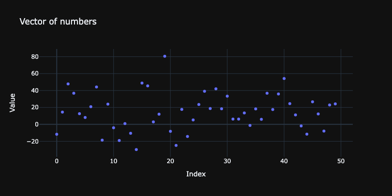
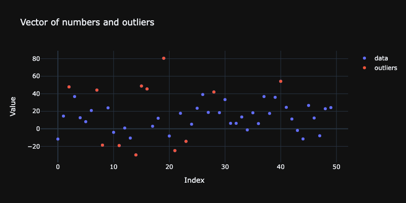

# OutlierIdentifiers

## In brief

This is a Python package for 1D outlier identifier functions. 
It follows closely the Wolfram Language (WL) paclet [AAp1], the R package [AAp2], and the Raku package [AAp3].

------

## Installation 

From PyPI.org:

```shell
python3 -m pip install OutlierIdentifiers
```

From GitHub:

```shell
python3 -m pip install git+https://github.com/antononcube/Python-packages.git#egg=OutlierIdentifiers\&subdirectory=OutlierIdentifiers
```

------

## Usage examples

Load packages:


```python
import numpy as np
import plotly.graph_objects as go

from OutlierIdentifiers import *
```

Generate a vector with random numbers:


```python
np.random.seed(148)
vec = np.random.normal(loc=10, scale=20, size=50)
print(vec)
```

    [-11.72170904  14.55374553  47.75335493  36.87806789  12.69444889
       8.2250113   20.83029617  44.23448925 -18.65374135  23.93151423
      -3.97345704 -19.05099802   0.87310981 -10.56871239 -29.7677599
      48.80181962  45.55051758   3.00608296  12.08663517  80.52839423
      -8.21300671 -24.80501442  17.67287628 -14.28033884   5.31536862
      23.47504393  39.11579282  18.77033001  41.99179563  18.45360056
      33.33802297   6.29308271   6.20961175  13.44694737  -1.2817423
      18.23874752   5.91890326  36.85941897  17.55470851  35.89537439
      54.16304716  24.50380733  11.14757566  -1.89050164 -11.59280058
      26.75050328  12.29007492  -7.9674614   22.91433048  24.18794845]


Plot the vector:


```python
# Create a scatter plot with markers
fig = go.Figure(data=go.Scatter(y=vec, mode='markers', name='data'))

# Add labels and title
fig.update_layout(title='Vector of numbers', xaxis_title='Index', yaxis_title='Value', template = "plotly_dark", width=800, height=400)

# Display the plot
fig.show()
```


Find outlier positions:


```python
outlier_identifier(vec, identifier=hampel_identifier_parameters)
```


    array([ True, False,  True,  True, False, False, False,  True,  True,
           False, False,  True, False,  True,  True,  True,  True, False,
           False,  True,  True,  True, False,  True, False, False,  True,
           False,  True, False, False, False, False, False, False, False,
           False,  True, False,  True,  True, False, False, False,  True,
           False, False,  True, False, False])


Find outlier values:


```python
outlier_identifier(vec, identifier=hampel_identifier_parameters, value = True)
```


    array([-11.72170904,  47.75335493,  36.87806789,  44.23448925,
           -18.65374135, -19.05099802, -10.56871239, -29.7677599 ,
            48.80181962,  45.55051758,  80.52839423,  -8.21300671,
           -24.80501442, -14.28033884,  39.11579282,  41.99179563,
            36.85941897,  35.89537439,  54.16304716, -11.59280058,
            -7.9674614 ])


Find *top* outlier positions and values:


```python
outlier_identifier(vec, identifier = lambda v: bottom_outliers(hampel_identifier_parameters(v)))
```


    array([ True, False, False, False, False, False, False, False,  True,
           False, False,  True, False,  True,  True, False, False, False,
           False, False,  True,  True, False,  True, False, False, False,
           False, False, False, False, False, False, False, False, False,
           False, False, False, False, False, False, False, False,  True,
           False, False,  True, False, False])


```python
outlier_identifier(vec, identifier = lambda v: top_outliers(hampel_identifier_parameters(v)), value=True)
```


    array([47.75335493, 36.87806789, 44.23448925, 48.80181962, 45.55051758,
           80.52839423, 39.11579282, 41.99179563, 36.85941897, 35.89537439,
           54.16304716])


Find *bottom* outlier positions and values (using quartiles-based identifier):


```python
# R-style positions
pred = outlier_identifier(vec, identifier = lambda v: bottom_outliers(quartile_identifier_parameters(v)))
pred
```


    array([False, False, False, False, False, False, False, False,  True,
           False, False,  True, False, False,  True, False, False, False,
           False, False, False,  True, False,  True, False, False, False,
           False, False, False, False, False, False, False, False, False,
           False, False, False, False, False, False, False, False, False,
           False, False, False, False, False])


```python
# Values
outlier_identifier(vec, identifier = lambda v: bottom_outliers(quartile_identifier_parameters(v)), value=True)
```


    array([-18.65374135, -19.05099802, -29.7677599 , -24.80501442,
           -14.28033884])


Here is another way to get the outlier values:


```python
vec[pred]
```


    array([-18.65374135, -19.05099802, -29.7677599 , -24.80501442,
           -14.28033884])


If position indexes are needed (instead of True/False vector) then `outlier_position` can be used:


```python
outlier_position(vec, identifier = lambda v: bottom_outliers(quartile_identifier_parameters(v)))
```


    array([ 8, 11, 14, 21, 23])


Here is a plot of the data and found outliers: 


```python
# Create a scatter plot with markers
fig = go.Figure(data=go.Scatter(y=vec, mode='markers', name='data'))

# Add labels and title
fig.update_layout(title='Vector of numbers and outliers', xaxis_title='Index', yaxis_title='Value', template = "plotly_dark", width=800, height=400)

# Find outliers positions and values
vec_outlier_indexes = outlier_position(vec, identifier=quartile_identifier_parameters)
vec_outlier_values = outlier_identifier(vec, identifier=quartile_identifier_parameters, value = True)

# Add outlier trace
fig.add_trace(go.Scatter(x=vec_outlier_indexes, y=vec_outlier_values, mode="markers", name="outliers"))

# Display the plot
fig.show()
```




The available outlier parameters functions are:

- `hampel_identifier_parameters`
- `splus_quartile_identifier_parameters`
- `quartile_identifier_parameters`


```python
[ f(vec) for f in (hampel_identifier_parameters, splus_quartile_identifier_parameters, quartile_identifier_parameters)]
```


    [(-7.059486458286688, 35.060179357392244),
     (-41.140817116725, 66.58661713715973),
     (-12.931512113918409, 40.93220501302396)]


------

## References 

[AA1] Anton Antonov,
["Outlier detection in a list of numbers"](https://mathematicaforprediction.wordpress.com/2013/10/16/outlier-detection-in-a-list-of-numbers/),
(2013),
[MathematicaForPrediction at WordPress](https://mathematicaforprediction.wordpress.com).

[AAp1] Anton Antonov,
[OutlierIdentifiers WL paclet](https://resources.wolframcloud.com/PacletRepository/resources/AntonAntonov/OutlierIdentifiers/),
(2023),
[Wolfram Language Paclet Repository](https://resources.wolframcloud.com/PacletRepository/).

[AAp2] Anton Antonov,
[OutlierIdentifiers R package](https://github.com/antononcube/R-packages/tree/master/OutlierIdentifiers),
(2019),
[R-packages at GitHub/antononcube](https://github.com/antononcube/R-packages).

[AAp3] Anton Antonov,
[OutlierIdentifiers Raku package](https://github.com/antononcube/Raku-Statistics-OutlierIdentifiers),
(2022),
[GitHub/antononcube](https://github.com/antononcube/).
