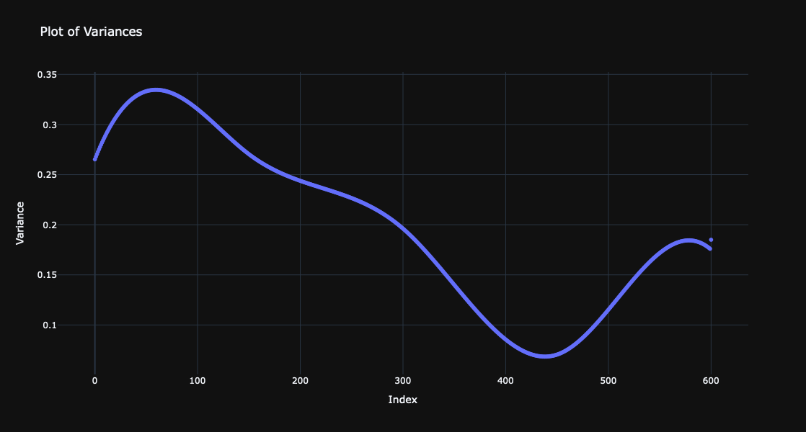

# Quantile Regression with B-splines

Anton Antonov    
[PythonForPrediction at WordPress](https://pythonforprediction.wordpress.com)   
August 2024

## Introduction


This notebook has explanations and examples of using the function `quantile_regression` provided by the Python package ["QuantileRegression"](https://pypi.org/project/QuantileRegression/), [AAp1].

The function `quantile_regression` computes [Quantile Regression (QR)](https://en.wikipedia.org/wiki/Quantile_regression) fits over a time series, a list of numbers or a list of numeric pairs using B-spline bases.

**Remark:** This notebook closely follows the page of the Wolfram Function Repository entry [`QuantileRegression`](https://resources.wolframcloud.com/FunctionRepository/resources/QuantileRegression/), [AAp2].

-------

## `quantile_regression`


`quantile_regression(data, knots, probs)`    
     does quantile regression over the times series or data array data using the knots specification knots for the probabilities probs.

`quantile_regression(data, knots, probs, opts)`    
     does quantile regression with the options opts.

### Details & Options

- `quantile_regression` works on numpy arrays, lists of numbers, and lists of numeric pairs.

- The curves computed with quantile regression are called **regression quantiles**.

- The regression quantiles corresponding to the specified probabilities are linear combinations of B-splines generated over the specified knots.

- In other words, `quantile_regression` computes fits using a B-spline functions basis. The basis is specified with the `knots` argument and the option `order`.

- The named argument `order` is 3 by default. 


-------

## Basic Examples

Make a random signal:


```python
import numpy as np

np.random.seed(23)
n = 200
rand_data = np.column_stack((np.arange(1, n + 1), np.random.uniform(0, 100, n)))
```

Compute `quantile_regression` with five knots for the probabilities $0.25$ and $0.75$:


```python
from QuantileRegression import *
q_funcs = quantile_regression(rand_data, knots = 5, probs = [0.25, 0.75])
```

Here is a plot of the original data and the obtained regression quantiles:


```python
import plotly.graph_objects as go

def qr_plot(data, q_funcs, probs, width=800, height=600):
    fig = go.Figure()
    
    fig.add_trace(go.Scatter(x=data[:, 0], y=data[:, 1], mode="markers", name="data"))
    
    fig.update_layout(
        xaxis_title='X Axis Label',
        yaxis_title='Y Axis Label',
        template='plotly_dark',
        width=width,
        height=height
    )
    
    # Plot each regression quantile
    for i, q in enumerate(probs):
        y_fit = [q_funcs[i](xi) for xi in data[:, 0]]
        fig.add_trace(go.Scatter(x=data[:, 0], y=y_fit, mode='lines', name=f'{q}'))

    return fig

qr_plot(rand_data, q_funcs, probs = [0.25, 0.75]).show()
```


Find the fraction of the data points that are under the second regression quantile:


```python
len([x for x in rand_data if x[1] < q_funcs[1](x[0])]) / len(rand_data)
```


    0.75


The obtained fraction is close to the second probability, $0.75$, given to `quantile_regression`.

------

## Scope

Here is a quantile regression computation over a numerical vector:


```python
vec_data = np.sin(np.arange(1, 201) / 6) + np.random.uniform(-0.5, 0.5, 200)
q_funcs = quantile_regression(vec_data, knots = 12, probs = 0.5)

vec_data2 = np.column_stack((np.arange(len(vec_data)), vec_data))
qr_plot(data = vec_data2, q_funcs = q_funcs, probs = [0.5,]).show()
```


The second argument—the knots specification—can be an integer specifying the number of knots or a list of numbers specifying the knots of the B-spline basis:


```python
qFuncs = quantile_regression(data=rand_data, knots=rand_data[::3, 0], probs=0.5)
qFuncs[0](100)
```


    69.5048709580442


--------

## Options

### `order` (interpolation order)

The option `order` specifies the polynomial order of the B-spline basis. Its values are expected to be non-negative integers:


```python
q_funcs = [quantile_regression(rand_data, knots = 5, probs = 0.5, order = i)[0] for i in [0, 1, 3]]
qr_plot(data = rand_data, q_funcs = q_funcs, probs = [0, 1, 3]).show()
```


-------

## Applications

### Fit for heteroscedastic data

Here is heteroscedastic data (the variance is not constant with respect to the predictor variable):


```python
x_values = np.arange(-3, 3.01, 0.01)
dist_data = np.array([
    (x, np.exp(-x**2) + np.random.normal(0, 0.15 * np.sqrt(abs(1.5 - x) / 1.5)))
    for x in x_values
])

fig = go.Figure(data=go.Scatter(x=dist_data[:, 0], y=dist_data[:, 1], mode='markers'))
fig.update_layout(
    title='Detailed Plot of distData',
    xaxis_title='x',
    yaxis_title='y',
    template='plotly_dark',
    width=800,
    height=600
)
fig.show()
```


Find quantile regression fits:


```python
probs = [0.1, 0.25, 0.5, 0.75, 0.9]
q_funcs = quantile_regression(dist_data, knots=4, probs=probs)
```

Plot the data and the regression quantiles:


```python
qr_plot(data = dist_data, q_funcs = q_funcs, probs = probs).show()
```


Note that the regression quantiles clearly outline the heteroscedastic nature of the data.

### Find variance anomalies

A certain contextual type of anomaly is a subset of points that have variance very different than other subsets. Using quantile regression we can (1) evaluate the regressor-dependent variance for each point using the regression quantiles $0.25$ and $0.75$; and (2) find the points that have outlier variances.

Here we compute and plot the variance estimates for a signal:


```python
q_funcs = quantile_regression(dist_data, knots=4, probs=[0.25, 0.75])

variances = np.abs([q_funcs[1](x) - q_funcs[0](x) for x in dist_data[:, 0]])

fig = go.Figure(data=go.Scatter(y=variances, mode='markers'))
fig.update_layout(
    title='Plot of Variances',
    xaxis_title='Index',
    yaxis_title='Variance',
    template='plotly_dark',
    width=800,
    height=600
)
fig.show()
```



Find the lower and upper thresholds for the variance outliers:


```python
median_distances = variances - np.median(variances)
lower_threshold, upper_threshold = np.quantile(median_distances, [0.2, 0.8])
(lower_threshold, upper_threshold)
```


    (-0.08599294135673308, 0.09164183342848714)


Find the outlier positions:


```python
variance_outlier_positions = np.where((median_distances < lower_threshold) | (median_distances > upper_threshold))[0]
```


```python
fig = go.Figure()
fig.add_trace(go.Scatter(x=dist_data[:, 0], y=dist_data[:, 1], mode='markers', name='data'))
fig.add_trace(go.Scatter(x=dist_data[variance_outlier_positions, 0], y=dist_data[variance_outlier_positions, 1], mode='markers', name='variance outliers'))

fig.update_layout(
    title='Plot of distData with Variance Outliers',
    xaxis_title='x',
    yaxis_title='y',
    template='plotly_dark',
    width=800,
    height=600
)
fig.show()
```


### Fit and anomalies for financial time series

Here is a financial time series:


```python
fin_data = [[3660854400, 236.16], [3662150400, 219.088], [3663360000, 217.166], [3664656000, 225.625], [3665865600, 232.085], [3667075200, 232.007], [3668371200, 244.466], [3669580800, 238.544], [3670790400, 237.622], [3672000000, 231.392], [3673209600, 230.854], [3674505600, 231.008], [3675715200, 229.316], [3677184000, 247.695], [3678393600, 243.312], [3679603200, 240.466], [3680812800, 240.851], [3682108800, 238.774], [3683318400, 228.162], [3684528000, 226.855], [3685737600, 222.857], [3686947200, 222.087], [3688156800, 236.468], [3689452800, 236.545], [3690662400, 242.235], [3691958400, 243.85], [3693254400, 241.158], [3694723200, 230.393], [3695932800, 231.008], [3697228800, 229.239], [3698438400, 227.163], [3699648000, 227.778], [3700857600, 231.008], [3702153600, 225.01], [3703363200, 220.703], [3704572800, 214.013], [3705868800, 212.167], [3707078400, 211.86], [3708374400, 201.094], [3709584000, 199.248], [3710793600, 198.249], [3712003200, 188.79], [3713212800, 193.326], [3714681600, 188.098], [3715891200, 188.943], [3717100800, 179.638], [3718310400, 156.953], [3719520000, 146.264], [3720816000, 141.573], [3722025600, 137.728], [3723321600, 133.652], [3724617600, 146.264], [3725913600, 124.04], [3727123200, 114.889], [3728592000, 112.658], [3729801600, 116.119], [3731011200, 99.124], [3732307200, 100.354], [3733516800, 112.89], [3734726400, 109.737], [3735936000, 117.58], [3737232000, 104.892], [3738441600, 99.0472], [3739737600, 103.277], [3740947200, 105.584], [3742156800, 101.278], [3743366400, 94.5872], [3744576000, 98.2016], [3745872000, 97.5096], [3747081600, 86.82], [3748291200, 94.7408], [3749500800, 86.8968], [3750710400, 65.98], [3752179200, 58.2904], [3753475200, 51.9848], [3754771200, 56.8288], [3756067200, 68.7488], [3757363200, 70.4408], [3758572800, 75.4392], [3760041600, 83.2056], [3761251200, 79.2], [3762460800, 79.04], [3763670400, 75.92], [3764966400, 74.64], [3766176000, 80.88], [3767385600, 79.68], [3768681600, 79.12], [3769891200, 82.72], [3771100800, 84.88], [3772396800, 80.48], [3773606400, 80.64], [3774816000, 64.08], [3776025600, 64.88], [3777321600, 74.72], [3778531200, 72.32], [3779740800, 70.4]]

fin_data = np.array(fin_data)

fin_data.shape
```


    (96, 2)


Do a quantile regression fit and plot it:


```python
q_funcs = quantile_regression(data = fin_data, knots=50, probs=0.5)
q_funcs
```


    [<function QuantileRegression.QuantileRegression._make_combined_function.<locals>.<lambda>(x)>]


```python
q_funcs = quantile_regression(data = fin_data, knots=20, probs=0.5)
qr_plot(data = fin_data, q_funcs=q_funcs, probs=[0.5,])
```


Here are the errors of the fit found:


```python
data = [(row[0], (q_funcs[0](row[0]) - row[1]) / row[1]) for row in fin_data]
dates, errors = zip(*data)

fig = go.Figure()
fig.add_trace(go.Scatter(x=dates, y=errors, mode='markers', fill='tozeroy'))
# plot_bgcolor='#1F1F1F',
fig.update_layout(xaxis_title='Date (s)', yaxis_title='Relative error', template="plotly_dark", height=400, width=800)
fig.show()
```


Find anomalies’ positions in the list of fit errors:


```python
from OutlierIdentifiers import *
pos = outlier_position(abs(np.array(errors)), identifier=lambda x: (splus_quartile_identifier_parameters(x)))
pos
```


    array([51, 56, 57, 70, 71, 73, 74, 75, 91, 92])


Plot the data, fit and anomalies:


```python
# Prepare data for plotting
dates, values = zip(*fin_data)
fit = [q_funcs[0](t) for t in dates]
anomalies = [values[i] for i in pos]
anomaly_times = [dates[i] for i in pos]

# Create the plot
fig = go.Figure()

# Add data points
fig.add_trace(go.Scatter(
    x=dates, y=values,
    mode='markers',
    marker=dict(color='gray', opacity=0.8),
    name='data'
))

# Add fit line
fig.add_trace(go.Scatter(
    x=dates, y=fit,
    mode='lines',
    line=dict(color='red', width=1),
    name='fit'
))

# Add anomalies
fig.add_trace(go.Scatter(
    x=anomaly_times, y=anomalies,
    mode='markers',
    marker=dict(color='blue', size=6),
    name='anomalies'
))

# Update layout
fig.update_layout(
    title='Financial Data Plot',
    xaxis_title='Date (s)',
    yaxis_title='Value',
    template="plotly_dark",
    legend=dict(title='Legend'),
    height=600,
    width=800
)

fig.show()
```


### Analyze temperature time series

Get temperature data:


```python
import pandas as pd

url = "https://raw.githubusercontent.com/antononcube/MathematicaVsR/master/Data/MathematicaVsR-Data-Atlanta-GA-USA-Temperature.csv"
dfTemperature = pd.read_csv(url)
dfTemperature['DateObject'] = pd.to_datetime(dfTemperature['Date'], format='%Y-%m-%d')
dfTemperature = dfTemperature[(dfTemperature['DateObject'].dt.year >= 2020) & (dfTemperature['DateObject'].dt.year <= 2023)]
dfTemperature
```


<div>
<style scoped>
    .dataframe tbody tr th:only-of-type {
        vertical-align: middle;
    }

    .dataframe tbody tr th {
        vertical-align: top;
    }

    .dataframe thead th {
        text-align: right;
    }
</style>
<table border="1" class="dataframe">
  <thead>
    <tr style="text-align: right;">
      <th></th>
      <th>Date</th>
      <th>AbsoluteTime</th>
      <th>Temperature</th>
      <th>DateObject</th>
    </tr>
  </thead>
  <tbody>
    <tr>
      <th>2555</th>
      <td>2020-01-01</td>
      <td>3786825600</td>
      <td>7.56</td>
      <td>2020-01-01</td>
    </tr>
    <tr>
      <th>2556</th>
      <td>2020-01-02</td>
      <td>3786912000</td>
      <td>7.28</td>
      <td>2020-01-02</td>
    </tr>
    <tr>
      <th>2557</th>
      <td>2020-01-03</td>
      <td>3786998400</td>
      <td>12.28</td>
      <td>2020-01-03</td>
    </tr>
    <tr>
      <th>2558</th>
      <td>2020-01-04</td>
      <td>3787084800</td>
      <td>12.78</td>
      <td>2020-01-04</td>
    </tr>
    <tr>
      <th>2559</th>
      <td>2020-01-05</td>
      <td>3787171200</td>
      <td>4.83</td>
      <td>2020-01-05</td>
    </tr>
    <tr>
      <th>...</th>
      <td>...</td>
      <td>...</td>
      <td>...</td>
      <td>...</td>
    </tr>
    <tr>
      <th>4011</th>
      <td>2023-12-27</td>
      <td>3912624000</td>
      <td>11.67</td>
      <td>2023-12-27</td>
    </tr>
    <tr>
      <th>4012</th>
      <td>2023-12-28</td>
      <td>3912710400</td>
      <td>7.44</td>
      <td>2023-12-28</td>
    </tr>
    <tr>
      <th>4013</th>
      <td>2023-12-29</td>
      <td>3912796800</td>
      <td>3.78</td>
      <td>2023-12-29</td>
    </tr>
    <tr>
      <th>4014</th>
      <td>2023-12-30</td>
      <td>3912883200</td>
      <td>4.83</td>
      <td>2023-12-30</td>
    </tr>
    <tr>
      <th>4015</th>
      <td>2023-12-31</td>
      <td>3912969600</td>
      <td>1.17</td>
      <td>2023-12-31</td>
    </tr>
  </tbody>
</table>
<p>1461 rows × 4 columns</p>
</div>


Convert the time series into a list of numeric pairs:


```python
temp_data = dfTemperature[['AbsoluteTime', 'Temperature']].to_numpy()
temp_data.shape
```


    (1461, 2)


Compute quantile regression fits:


```python
probs = np.sort(np.concatenate((np.arange(0.1, 1.0, 0.1), [0.01, 0.99])))
q_funcs = quantile_regression(data=temp_data, knots=10, probs=probs)
```

Plot the data and the regression quantiles:


```python
qr_plot(data = temp_data, q_funcs=q_funcs, probs=probs, width=1200)
```


Find an estimate of the conditional Cumulative Distribution Function (CDF) at the date 2022-10-01:


```python
focus_date = '2022-10-01'
row = dfTemperature[dfTemperature['Date'] == focus_date]
row
```


<div>
<style scoped>
    .dataframe tbody tr th:only-of-type {
        vertical-align: middle;
    }

    .dataframe tbody tr th {
        vertical-align: top;
    }

    .dataframe thead th {
        text-align: right;
    }
</style>
<table border="1" class="dataframe">
  <thead>
    <tr style="text-align: right;">
      <th></th>
      <th>Date</th>
      <th>AbsoluteTime</th>
      <th>Temperature</th>
      <th>DateObject</th>
    </tr>
  </thead>
  <tbody>
    <tr>
      <th>3559</th>
      <td>2022-10-01</td>
      <td>3873571200</td>
      <td>17.83</td>
      <td>2022-10-01</td>
    </tr>
  </tbody>
</table>
</div>


```python
q_func_values = [func(row['AbsoluteTime'].values[0]) for func in q_funcs]
fig = go.Figure(data=[go.Scatter(x=q_func_values, y=probs, mode='lines')])
# Update layout
fig.update_layout(
    title='Temperature Data CDF at ' + focus_date,
    xaxis_title='Temperature',
    yaxis_title='Probability',
    template="plotly_dark",
    legend=dict(title='Legend'),
    height=600,
    width=800
)
fig.show()
```


Find outliers in the temperature data—outliers are defined as points below or above the $0.02$ and $0.98$ regression quantiles respectively:


```python
# Calculate regression quantiles
q_funcs = quantile_regression(temp_data, 10, [0.02, 0.98])

# Get the corresponding bottom and top outliers
bottom_regression_quantile = [(x, q_funcs[0](x)) for x in temp_data[:,0]]
top_regression_quantile = [(x, q_funcs[-1](x)) for x in temp_data[:,0]]

qr_bottom_outliers = [r for r in temp_data if q_funcs[0](r[0]) > r[1]]
qr_top_outliers = [r for r in temp_data if q_funcs[1](r[0]) < r[1]]

# Create plotly figure
fig = go.Figure()

# Add original data
fig.add_trace(go.Scatter(x=temp_data[:,0], y=temp_data[:,1], mode='markers', name='original data', marker=dict(color="gray", size=2)))

# Add bottom regression quantile
fig.add_trace(go.Scatter(x=[x for x, _ in bottom_regression_quantile], y=[y for _, y in bottom_regression_quantile], mode='lines', name='bottom regression quantile', line=dict(color='gray', width=1)))

# Add top regression quantile
fig.add_trace(go.Scatter(x=[x for x, _ in top_regression_quantile], y=[y for _, y in top_regression_quantile], mode='lines', name='top regression quantile', line=dict(color='gray', width=1)))

# Add bottom outliers
fig.add_trace(go.Scatter(x=[row[0] for row in qr_bottom_outliers], y=[row[1] for row in qr_bottom_outliers], mode='markers', name='bottom outliers', marker=dict(size=6)))

# Add top outliers
fig.add_trace(go.Scatter(x=[row[0] for row in qr_top_outliers], y=[row[1] for row in qr_top_outliers], mode='markers', name='top outliers', marker=dict(size=6)))

# Update layout
fig.update_layout(
    title='Temperature Data',
    xaxis_title='Time',
    yaxis_title='Temperature',
    legend_title='Legend',
    template="plotly_dark"
)

# Show plot
fig.show()
```


-------

## Properties and Relations

`quantile_regression` can be compared with functions Linear Regression Fit (LRF):


```python
from scipy.optimize import curve_fit

# Extract x and y coordinates
x = dist_data[:, 0]
y = dist_data[:, 1]

# Define the basis functions
def basis_functions(x, a0, a1, a2, a3, a4, a5, a6):
    return a0 + a1*x + a2*x**2 + a3*x**3 + a4*x**4 + a5*x**5 + a6*x**6

# Perform linear regression using curve fitting
params, _ = curve_fit(basis_functions, x, y)

# Define the fitted function
def fitted_func(x):
    return basis_functions(x, *params)
# Generate linear regression fitted curve
x_curve = np.linspace(x.min(), x.max(), 100)
y_curve = fitted_func(x_curve)

# Regression quantile
q_func = quantile_regression(dist_data, 6, 0.5)[0]
qr_y_curve = q_func(x_curve)

# Create plot
fig = go.Figure()

# Add scatter plot for original data points
fig.add_trace(go.Scatter(x=x, y=y, mode='markers', name='data'))

# Add line plot for fitted curve
fig.add_trace(go.Scatter(x=x_curve, y=y_curve, mode='lines', name='mean'))

# Add line plot for regression quantile
fig.add_trace(go.Scatter(x=x_curve, y=qr_y_curve, mode='lines', name='0.5'))

# Update layout
fig.update_layout(title='Polynomial Regression',
                  xaxis_title='X',
                  yaxis_title='Y',
                  template = "plotly_dark"
                  )

# Show plot
fig.show()
```


Quantile regression is much more robust than linear regression. In order to demonstrate that, add a few large outliers in the data:


```python
# New points to be added
new_points = np.array([[1.5, 10], [2.2, 30]])

# Combine the original data with the new points
combined_data = np.vstack((dist_data, new_points))

# Sort the combined data by the first column (x values)
dist_data3 = combined_data[combined_data[:, 0].argsort()]
```

Here quantile regression and linear regression are applied, as in the previous example,
then the obtained curves are plotted. Note that the curve corresponding to linear regression is different and a worse fit than the one from the previous example:


```python
# Extract x and y coordinates
x = dist_data3[:, 0]
y = dist_data3[:, 1]

# Define the basis functions
def basis_functions(x, a0, a1, a2, a3, a4, a5, a6):
    return a0 + a1*x + a2*x**2 + a3*x**3 + a4*x**4 + a5*x**5 + a6*x**6

# Perform linear regression using curve fitting
params, _ = curve_fit(basis_functions, x, y)

# Define the fitted function
def fitted_func(x):
    return basis_functions(x, *params)

# Generate linear regression fitted curve
x_curve = np.linspace(x.min(), x.max(), 100)
y_curve = fitted_func(x_curve)

# Regression quantile
q_func = quantile_regression(dist_data3, 6, 0.5)[0]
qr_y_curve = q_func(x_curve)

# Create plot
fig = go.Figure()

# Add scatter plot for original data points
fig.add_trace(go.Scatter(x=x, y=y, mode='lines', name='data'))

# Add line plot for fitted curve
fig.add_trace(go.Scatter(x=x_curve, y=y_curve, mode='lines', name='mean'))

# Add line plot for regression quantile
fig.add_trace(go.Scatter(x=x_curve, y=qr_y_curve, mode='lines', name='0.5'))

# Update layout
fig.update_layout(title='Linear Regression vs Quantile Regression',
                  xaxis_title='X',
                  yaxis_title='Y',
                  template = "plotly_dark",
                  yaxis=dict(range=[-0.5, 1.5])
                  )

# Show plot
fig.show()
```


-----

## Possible Issues

#### Slow computations

Because of the linear programming formulation for some data and knots specifications, the computations can be slow.

#### Fitting for probabilities 0 and 1

For most data, the quantile regression fitting for probabilities $0$ and $1$ *might or might not* produce regression quantiles that are "too far away from the data."

Find regression quantiles for probabilities $0$ and $0.5$ and plot them:


```python
probs = [0, 0.5]
q_funcs = quantile_regression(dist_data, 6, probs)
qr_plot(data=dist_data, q_funcs=q_funcs, probs=probs).show()
```


Find regression quantiles for probabilities $0.5$ and $1$ and plot them:

```python
probs = [0.5, 1]
q_funcs = quantile_regression(dist_data, 6, probs)
qr_plot(data=dist_data, q_funcs=q_funcs, probs=probs).show()
```


### Overfitting

Consider the following nonlinear data:


```python
temp_data2 = temp_data[0:730,:]
fig = go.Figure(data=go.Scatter(x=temp_data2[:, 0], y=temp_data2[:, 1], mode='markers'))
fig.update_layout(
    title='Partial temperature data',
    xaxis_title='x',
    yaxis_title='y',
    template='plotly_dark',
    width=800,
    height=600
)
fig.show()
```


Make a quantile regression fit with 20 knots:


```python
qFunc20 = quantile_regression(temp_data2, knots=20, probs = 0.5, order = 2)[0]
```

Make a quantile regression fit with 90 knots:


```python
qFunc90 = quantile_regression(temp_data2, knots=90, probs = 0.5, order = 2)[0]
```

Plot the regression quantiles and the data:


```python
qr_plot(temp_data2, q_funcs=[qFunc20, qFunc90], probs=[20, 90]).show()
```


You can see that the regression quantile computed with 90 knots is "overfitted".

### Intersecting regression quantiles

When regression quantiles are overfitted, then the estimate of the conditional cumulative distribution function (CDF) can be problematic—the estimated CDF is not a monotonically increasing function.

Compute regression quantiles using “too many” knots:


```python
probs = sorted(np.concatenate((np.arange(0.1, 1, 0.1), [0.01, 0.99])))
q_funcs = quantile_regression(dist_data, 30, probs)
qr_plot(data=dist_data, q_funcs=q_funcs, probs=probs, width=1200, height=400).show()
```


Plot the regression quantiles:finData2 = N@{10532750, 1342440, 714972, 1289802, 1302765, 814231, 830680, 416649, 80017, 24343, 1808, 1939, 25848, 32532, 21807, 26108, 12581, 36315, 34544, 3827, 7631, 7259};


Here is the estimated conditional CDF:


```python
temp_data[100][0]
```


    3795465600.0


```python
q_func_values = [func(temp_data[100][0]) for func in q_funcs]
fig = go.Figure(data=[go.Scatter(x=q_func_values, y=probs, mode='lines')])
# Update layout
fig.update_layout(
    title='Temperature Data CDF at ' + str(temp_data[100][0]),
    xaxis_title='Temperature',
    yaxis_title='Probability',
    template="plotly_dark",
    legend=dict(title='Legend'),
    height=600,
    width=800
)
fig.show()#%% md

```


### Rescaling

For certain data, it is beneficial to rescale the predictor values, predicted values, or both before doing the quantile regression computations:


```python
finData2 = [10532750, 1342440, 714972, 1289802, 1302765, 814231, 830680, 416649, 80017, 24343, 1808, 1939, 25848, 32532, 21807, 26108, 12581, 36315, 34544, 3827, 7631, 7259]
```


```python
probs = [0.2, 0.5, 0.8]
q_funcs = quantile_regression(finData2, 4, probs)
[f(10) for f in q_funcs]
```


    [-149111.06428218874, 131492.853948295, 135002.949117364]


```python
xMin = np.min(finData2)
xMax = np.max(finData2)

finData2r = [ (x - xMin) / (xMax - xMin) for x in finData2]
q_funcs = quantile_regression(finData2r, 4, probs)
[f(10) for f in q_funcs]
```


    [-0.014330998638785362, 0.012314605071850088, 0.012647961513543922]


```python
finData2r2 =np.column_stack((np.arange(len(finData2r)), finData2r))
qr_plot(finData2r2, q_funcs, probs)
```


------

## References

[AAp1] Anton Antonov, 
[QuantileRegression Python package](https://pypi.org/project/QuantileRegression/),
(2024),
[PyPI.org/antononcube](https://pypi.org/user/antononcube/).

[AAp2] Anton Antonov,
[QuantileRegression](https://resources.wolframcloud.com/FunctionRepository/resources/QuantileRegression/),
(2019),
[Wolfram Function Repository](https://resources.wolframcloud.com/FunctionRepository).
